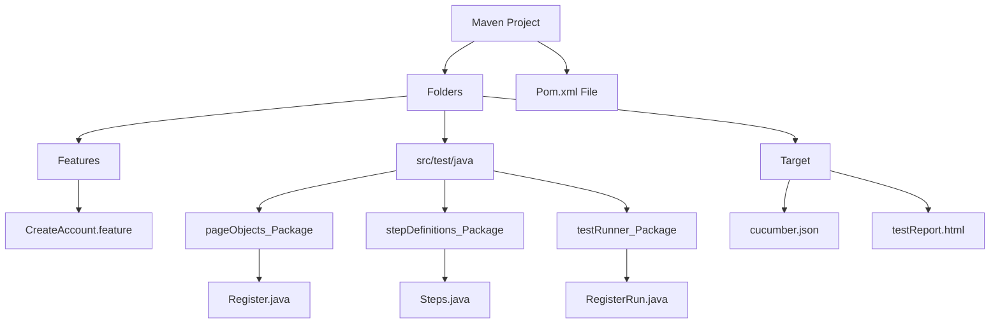

# Flowchart: Folder Structure

```mermaid
graph TD;
  a[Maven Project] --> b[Folders];
  a --> d[Pom.xml File];
  b --> c[Features];
  b --> e[src/test/java];
  b --> f[Target];
  c --> CreateAccount.feature;
  e --> g[pageObjects_Package];
  e --> h[stepDefinitions_Package];
  e --> i[testRunner_Package];
  g --> Register.java;
  h --> Steps.java;
  i --> RegisterRun.java;
  f --> cucumber.json;
  f --> testReport.html;
```

# Flowchart: Folder Structure
```mermaid
graph TD;
  
```
